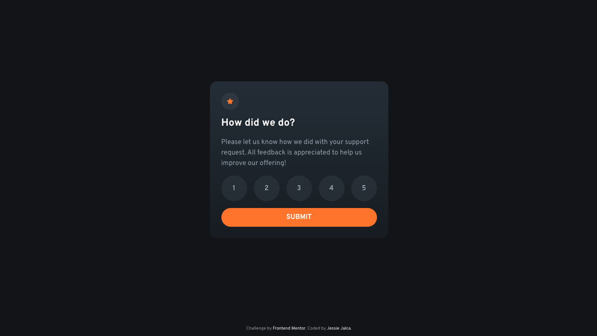

# Frontend Mentor - Interactive rating component solution

This is a solution to the [Interactive rating component challenge on Frontend Mentor](https://www.frontendmentor.io/challenges/interactive-rating-component-koxpeBUmI). Frontend Mentor challenges help you improve your coding skills by building realistic projects. 

## Table of contents

- [Frontend Mentor - Interactive rating component solution](#frontend-mentor---interactive-rating-component-solution)
  - [Table of contents](#table-of-contents)
  - [Overview](#overview)
    - [The challenge](#the-challenge)
    - [Screenshot](#screenshot)
    - [Links](#links)
  - [My process](#my-process)
    - [Built with](#built-with)
    - [What I learned](#what-i-learned)
      - [Styling an element based on its child's status](#styling-an-element-based-on-its-childs-status)
    - [Continued development](#continued-development)
    - [Useful resources](#useful-resources)
  - [Author](#author)

**Note: Delete this note and update the table of contents based on what sections you keep.**

## Overview

### The challenge

Users should be able to:

- View the optimal layout for the app depending on their device's screen size
- See hover states for all interactive elements on the page
- Select and submit a number rating
- See the "Thank you" card state after submitting a rating

### Screenshot



### Links

- [Solution Repo](https://github.com/jessiejalca/frontend-mentor-challenges/tree/main/challenges/interactive-rating-component-main)
- [Live Site](https://jalca-interactive-rating-component.netlify.app/)

## My process

### Built with

- Semantic HTML5 markup
- CSS/Sass
- Flexbox
- CSS Grid
- Mobile-first workflow
- Vanilla JS

### What I learned

#### Styling an element based on its child's status

Part of this challenge is to provide feedback to the user by highlighting the whichever given radio input the user selects. However, the label and the input are two distinct elements:
```html
<!-- label/input format for radio buttons within a form -->
<label for="1"
  ><input type="radio" id="1" name="rating" value="1" />1</label
>
```
So to style the radio form as designed, I decided to visually hide the input button and style the label to _look_ like an input method. However, one major challenge I ran into was visually selecting the label, because the the `:checked` pseudo-class selector is specific to its associated input. As a solution, I came across this newer pseudo-class: `:has`, which can be used to target a parent element based on the child it contains.
```scss
// change the color when checked
&:has(> input[type="radio"]:checked) {
  background-color: $orange;
  color: $white;
}
```
Note: Because `:has` is a newer feature to CSS, it doesn't work in some browsers. I included a link below for more information. An alternative solution would be to use JavaScript to implement similar conditional styling.

### Continued development

Although my solution works well for most users, it may not for visually impaired users or others that use keyboards to navigate and make selections. I want to look further into more accessible solutions to hopefully improve and future projects.

I hope to start using JavaScript libraries and frameworks, like React, Bootstrap, and Svelte in future projects for practice.

### Useful resources

- [:has() CSS pseudo-class](https://developer.mozilla.org/en-US/docs/Web/CSS/:has) - MDN article describing the `:has()` pseudo-class.

## Author

Frontend Mentor - [@jessiejalca](https://www.frontendmentor.io/profile/jessiejalca)
